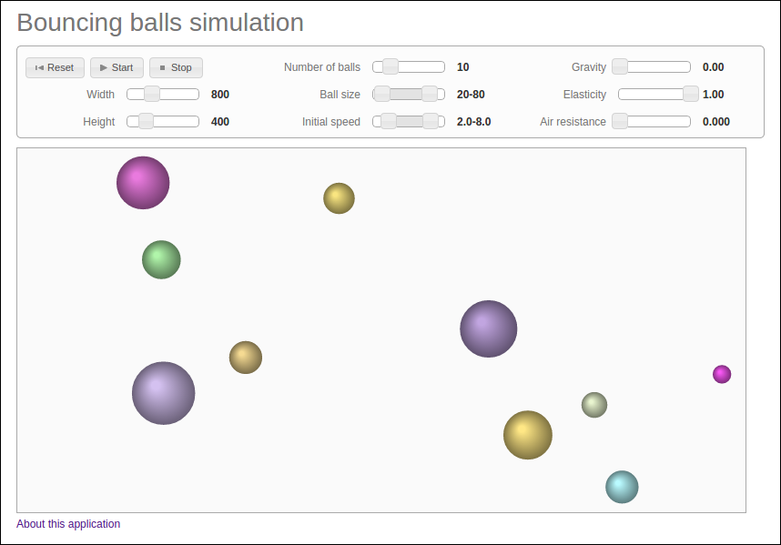

# ボール衝突運動シミュレーション(HTML5 canvasデモ)

日本語 | [English](/README.md)

2次元平面上のボール運動シミュレーションです。

* <http://higuma.github.io/bouncing-balls/>

## 使用ライブラリ

* [jQuery](http://jquery.com/)
* [jQuery UI](http://jqueryui.com/)

## ライセンス

MIT (See [LICENSE.txt](/LICENSE.txt))
